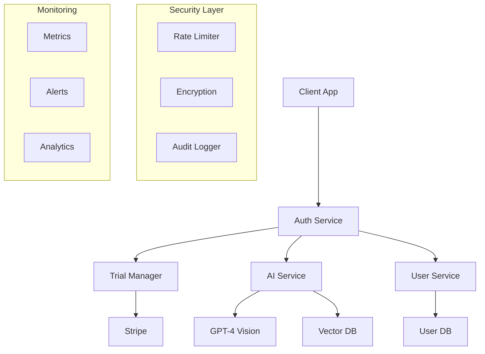
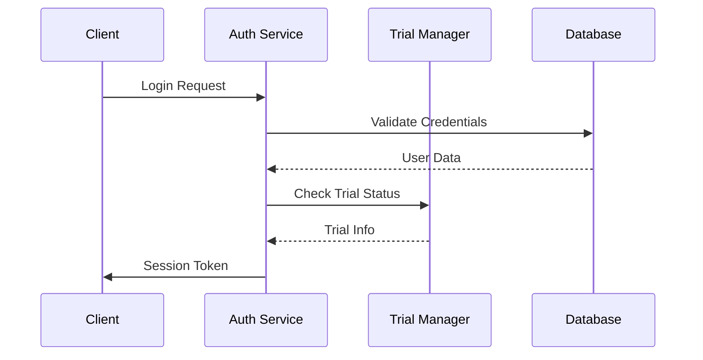
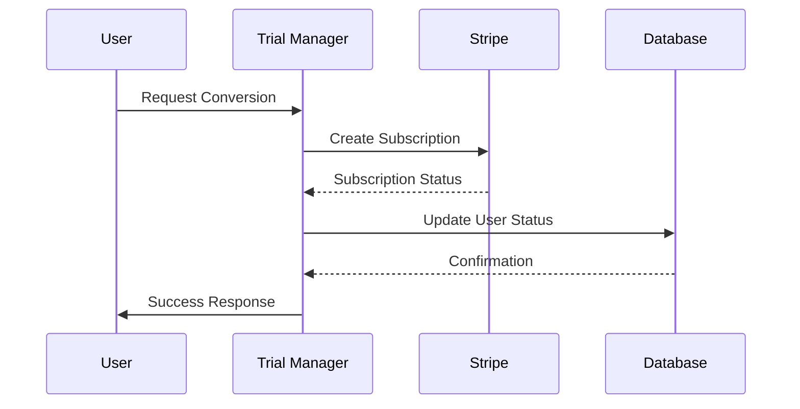

# System Architecture

## High-Level Architecture



## Component Interactions

### Authentication Flow
1. User initiates authentication
2. Auth service validates credentials
3. Trial status is checked
4. Session token is generated
5. User preferences are loaded

### Trial Management Flow
1. New user registration
2. Trial period initialization
3. Usage tracking begins
4. Conversion prompting
5. Premium transition

## API Endpoints

### Authentication Endpoints
```python
@router.post("/auth/register")
async def register_user(user_data: UserRegistration) -> UserResponse:
    """Register a new user with trial access"""
    pass

@router.post("/auth/login")
async def login_user(credentials: UserCredentials) -> TokenResponse:
    """Authenticate user and return session token"""
    pass

@router.post("/auth/refresh")
async def refresh_token(refresh_token: str) -> TokenResponse:
    """Refresh an expired access token"""
    pass
```

### Trial Management Endpoints
```python
@router.get("/trial/status")
async def get_trial_status(user_id: int) -> TrialStatus:
    """Get current trial status and usage metrics"""
    pass

@router.post("/trial/convert")
async def convert_to_premium(user_id: int, payment_data: PaymentInfo) -> ConversionResponse:
    """Convert trial user to premium"""
    pass
```

### User Management Endpoints
```python
@router.get("/user/profile")
async def get_user_profile(user_id: int) -> UserProfile:
    """Get user profile and preferences"""
    pass

@router.put("/user/preferences")
async def update_preferences(user_id: int, preferences: UserPreferences) -> UpdateResponse:
    """Update user preferences"""
    pass
```

## Data Flow Diagrams

### Authentication Flow


### Trial Conversion Flow


[Back to Overview](01_overview.md)
