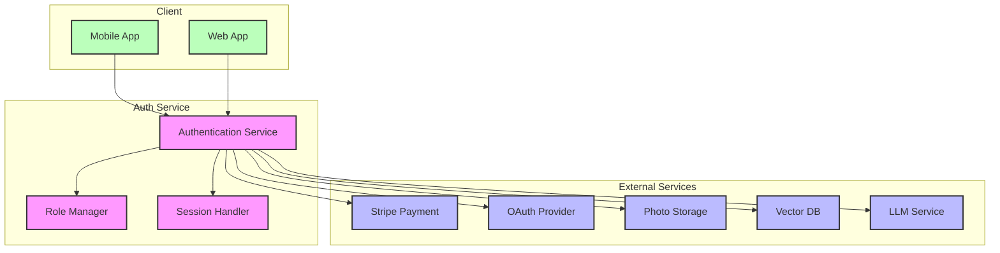
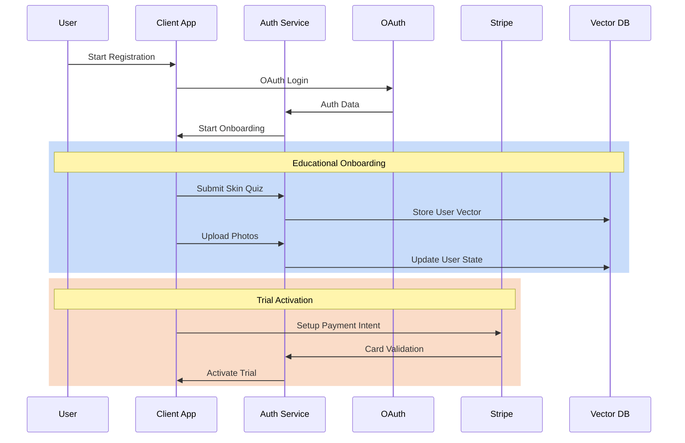
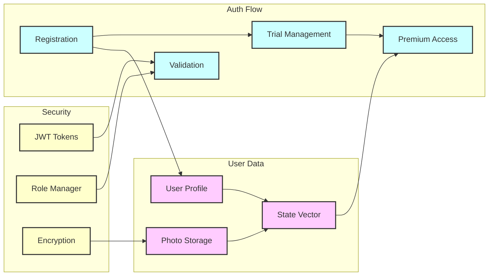
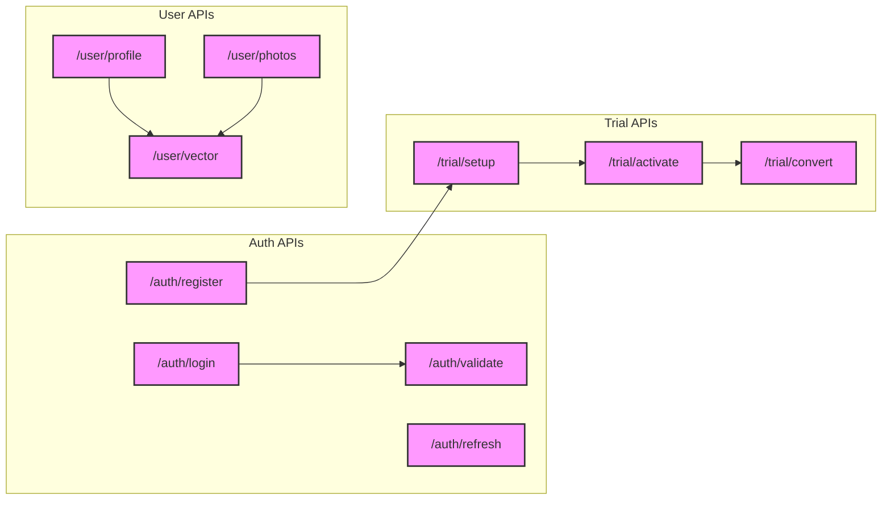
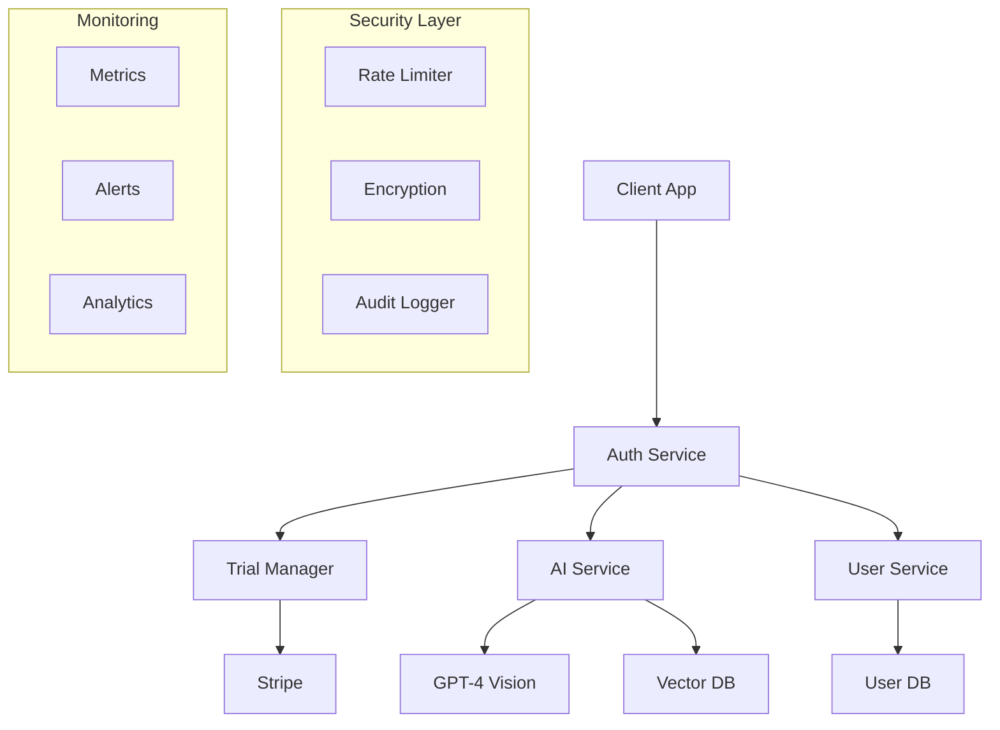

# Dab App: Senior Backend Developer Take-Home Assessment
## Authentication Component Design

### 1. Component Selection & Context

#### 1.1 Original Context

The authentication component was originally developed for FlyFlat, a premium travel services platform handling sensitive data for high-net-worth clients and requiring integration with multiple premium partner networks.

**Complete Technology Stack**:
- FastAPI for microservices
- PostgreSQL for data persistence
- Redis for high-performance caching
- OAuth for federated authentication
- Pydantic for data validation
- Docker for containerization
- Celery for asynchronous processing

**Authentication System**:
- **Modular Architecture**:
  - Independent services for auth, roles, and API keys
  - Middleware for automatic token verification
  - Pydantic schemas for robust validation
  - Decorators for granular access control

- **Security Features**:
  - Secure session management with JWT tokens
  - Hierarchical role system (ADMIN, CONCIERGE, CUSTOMER)
  - API key validation for B2B integrations
  - Sensitive data encryption
  - Compliance with financial data security standards

- **Integrations**:
  - Payment systems for premium transactions
  - Partner networks (BitKraft, Stanford MBA, INDI, Select Black Card)
  - Real-time notification system
  - WhatsApp for concierge service

**Key Achievements**:
- Secure processing of premium bookings (+$5,000)
- Support for multiple premium client segments
- Proven scalability in enterprise environment
- 100% type coverage with MyPy
- Robust CI/CD pipeline

#### 1.2 Domain Adaptation for Dab

FlyFlat's enterprise architecture provides a solid foundation for Dab:

**Architecture**:
- Easily adaptable modular microservices
- Extensible role system for premium features
- Distributed and scalable session management
- Data validation with Pydantic
- Proven payment system integration

**Advantages for Dab**:
- Experience in handling sensitive data (user photos)
- Proven multi-tenant authentication system
- High-performance ready architecture
- Flexible integration with external services (AI, storage)
- Ability to scale with demand

FlyFlat's robust security architecture and sensitive data handling align perfectly with Dab's requirements for secure user data and personal photo management.

### 2. Domain Adaptation Design

#### 2.1 Authentication Flow

The authentication system will be adapted to support Dab's trial-only model and educational onboarding process:

**Trial-Only Registration Flow**:
1. **Initial Sign-up**:
   - OAuth-based authentication (reusing existing implementation)
   - Basic profile creation (email, name)
   - Educational onboarding initiation

2. **Educational Onboarding**:
   - Multi-step onboarding process tracking
   - Skin type questionnaire completion
   - Initial photo upload guidance
   - Skincare goals definition

3. **Trial Activation**:
   - Stripe integration for card validation
   - No immediate charge (trial period)
   - Premium features unlocked during trial
   - Clear trial expiration tracking

4. **Premium Conversion**:
   - Automated trial-to-premium conversion
   - Subscription activation via stored card
   - Graceful degradation to basic features if declined

#### 2.2 Required Integrations

**Core Integrations**:
1. **Stripe Integration**:
   - Setup-intent for card validation
   - Subscription management
   - Failed payment handling
   - Compliant card data storage

2. **Photo Management**:
   - Secure photo upload/storage
   - Before/after image pairing
   - Metadata tracking (timestamps, conditions)
   - Privacy-focused access control

3. **Vector Database**:
   - User state vector storage
   - Progress tracking
   - Recommendation data
   - Historical analysis

4. **LLM Integration**:
   - Personalized onboarding flow
   - Skin analysis assistance
   - Routine recommendations
   - Educational content delivery

#### 2.3 Role-Based Access Control

**User Roles and Permissions**:
1. **Trial User**:
   - Full feature access
   - Time-limited permissions
   - Trial status indicators
   - Conversion prompts

2. **Premium User**:
   - Unlimited feature access
   - Advanced analytics
   - Personalization chat
   - History dashboard

3. **Basic User** (Post-trial, no subscription):
   - Limited feature set
   - Basic progress tracking
   - Upgrade prompts
   - Core educational content

4. **Admin/Support**:
   - User management
   - Content management
   - Analytics access
   - Support tools

#### 2.4 Security and Privacy

**Data Protection Measures**:
1. **Photo Security**:
   - End-to-end encryption
   - Temporary URLs for access
   - Secure deletion options
   - Access logging

2. **Personal Data**:
   - GDPR/CCPA compliance
   - Data minimization
   - Consent management
   - Export/deletion capabilities

3. **Payment Security**:
   - PCI compliance via Stripe
   - Tokenized card storage
   - Secure payment flows
   - Audit logging

### 3. Architecture Diagrams

#### 3.1 High-Level System Architecture



#### 3.2 Authentication Flow Sequence



#### 3.3 Data Flow Architecture



#### 3.4 API Integration Points



These diagrams illustrate:
1. The overall system architecture and component relationships
2. The sequential flow of the authentication and trial activation process
3. The data flow between different system components
4. The API integration points and their relationships

Each diagram is embedded in the Markdown and will be rendered automatically by Markdown viewers that support Mermaid syntax (like GitHub).

### 4. Implementation Details

#### 4.1 Core Authentication Schemas

```python
from enum import Enum
from typing import Optional, List
from pydantic import BaseModel, EmailStr, Field
from datetime import datetime

class UserRole(str, Enum):
    """Dab user roles"""
    ADMIN = "admin"
    PREMIUM = "premium"
    TRIAL = "trial"
    BASIC = "basic"

class TrialStatus(str, Enum):
    """Trial states"""
    PENDING = "pending"      # Card validated, trial not started
    ACTIVE = "active"        # Trial period ongoing
    COMPLETED = "completed"  # Converted to premium
    EXPIRED = "expired"      # Trial ended, no conversion

class AuthValidationRequest(BaseModel):
    """Initial auth validation request"""
    auth_user_id: str = Field(..., description="OAuth provider ID")
    email_address: EmailStr = Field(..., description="User email")
    first_name: Optional[str] = None
    last_name: Optional[str] = None

class OnboardingStatus(BaseModel):
    """Tracks educational onboarding progress"""
    skin_quiz_completed: bool = False
    initial_photos_uploaded: bool = False
    goals_defined: bool = False
    routine_logged: bool = False
    
class UserProfile(BaseModel):
    """Extended user profile with Dab-specific fields"""
    customer_id: int
    role: UserRole
    trial_status: Optional[TrialStatus]
    trial_expires_at: Optional[datetime]
    stripe_customer_id: Optional[str]
    onboarding_status: OnboardingStatus
    skin_type: Optional[str]
    concerns: List[str] = []
```

#### 4.2 Authentication Service Implementation

```python
class DabAuthService:
    """
    Enhanced authentication service for Dab's trial-only model.
    Extends FlyFlat's base authentication with trial and onboarding.
    """
    
    TRIAL_DAYS = 14
    
    def __init__(
        self,
        user_repository,
        stripe_service,
        photo_service,
        vector_service
    ):
        self.user_repository = user_repository
        self.stripe_service = stripe_service
        self.photo_service = photo_service
        self.vector_service = vector_service

    async def validate_user(
        self, 
        user_data: AuthValidationRequest
    ) -> UserProfile:
        """Validate OAuth user and create/update profile"""
        user = await self.user_repository.get_by_email(user_data.email_address)
        
        if not user:
            # New user flow
            stripe_customer = await self.stripe_service.create_customer(
                email=user_data.email_address,
                name=f"{user_data.first_name} {user_data.last_name}"
            )
            
            user = await self.user_repository.create_user({
                "auth_user_id": user_data.auth_user_id,
                "email": user_data.email_address,
                "role": UserRole.TRIAL,
                "stripe_customer_id": stripe_customer.id,
                "onboarding_status": OnboardingStatus()
            })
            
        return await self._enrich_user_profile(user)

    async def setup_trial(
        self,
        user_id: int,
        payment_method_id: str
    ) -> UserProfile:
        """Setup trial with card validation"""
        user = await self.user_repository.get_by_id(user_id)
        
        # Validate card without charge
        await self.stripe_service.validate_payment_method(
            customer_id=user.stripe_customer_id,
            payment_method_id=payment_method_id
        )
        
        # Update trial status
        user.trial_status = TrialStatus.PENDING
        user = await self.user_repository.update(user)
        
        return await self._enrich_user_profile(user)

    async def activate_trial(
        self,
        user_id: int
    ) -> UserProfile:
        """Activate trial after onboarding completion"""
        user = await self.user_repository.get_by_id(user_id)
        
        if not self._is_onboarding_complete(user.onboarding_status):
            raise ValueError("Onboarding must be completed first")
            
        # Set trial expiration
        user.trial_status = TrialStatus.ACTIVE
        user.trial_expires_at = datetime.now() + timedelta(days=self.TRIAL_DAYS)
        user = await self.user_repository.update(user)
        
        return await self._enrich_user_profile(user)

    async def convert_to_premium(
        self,
        user_id: int
    ) -> UserProfile:
        """Convert trial to premium subscription"""
        user = await self.user_repository.get_by_id(user_id)
        
        # Create Stripe subscription
        subscription = await self.stripe_service.create_subscription(
            customer_id=user.stripe_customer_id
        )
        
        # Update user status
        user.role = UserRole.PREMIUM
        user.trial_status = TrialStatus.COMPLETED
        user = await self.user_repository.update(user)
        
        return await self._enrich_user_profile(user)

    def _is_onboarding_complete(self, status: OnboardingStatus) -> bool:
        """Check if educational onboarding is complete"""
        return all([
            status.skin_quiz_completed,
            status.initial_photos_uploaded,
            status.goals_defined,
            status.routine_logged
        ])

    async def _enrich_user_profile(self, user) -> UserProfile:
        """Add additional user data from various services"""
        profile = UserProfile(**user.dict())
        
        # Add vector state if exists
        vector_state = await self.vector_service.get_user_state(user.id)
        if vector_state:
            profile.skin_type = vector_state.skin_type
            profile.concerns = vector_state.concerns
            
        return profile
```

#### 4.3 Key Implementation Notes

1. **Enhanced Role System**
   - Added trial-specific roles and states
   - Clear progression: TRIAL → PREMIUM or BASIC
   - Granular permission control

2. **Trial Management**
   - Two-step trial activation (card validation + onboarding)
   - Automatic trial expiration tracking
   - Graceful status transitions

3. **Educational Onboarding**
   - Structured progress tracking
   - Required steps before trial activation
   - Integration with vector state

4. **Stripe Integration**
   - Early customer creation
   - Card validation without charge
   - Smooth trial-to-premium conversion

The implementation extends FlyFlat's robust authentication foundation while adding Dab-specific features for trial management, educational onboarding, and premium feature access.

### 5. Design Considerations, Tradeoffs, & Risks

#### 5.1 Design Tradeoffs

##### UX vs Security Tradeoffs

| UX Enhancement | Security Impact | Mitigation Strategy |
|---------------|-----------------|-------------------|
| Single OAuth flow | Reduced multi-factor options | Enhanced session monitoring and risk-based authentication |
| Persistent sessions | Increased session hijack risk | Short-lived JWT + secure HTTP-only refresh tokens |
| Photo upload simplicity | Potential metadata exposure | Server-side metadata stripping and secure URL generation |
| Quick trial activation | Payment fraud risk | Stripe radar integration + behavior monitoring |

##### Simplicity vs Functionality

| Simple Approach | Full Feature | Chosen Balance |
|----------------|--------------|----------------|
| Basic role system | Fine-grained permissions | Role-based with trial states |
| Local file storage | Distributed CDN | S3 + CloudFront with signed URLs |
| Single region | Multi-region deployment | Primary region + read replicas |
| Synchronous processing | Event-driven architecture | Hybrid: Critical paths sync, background tasks async |

#### 5.2 Risk Analysis & Mitigation

##### Data Security Risks

1. **Sensitive Photo Data**
   - **Risk**: Unauthorized access to user photos
   - **Mitigation**:
     - End-to-end encryption for photo storage
     - Temporary signed URLs with short expiration
     - Access logging and anomaly detection
     - Regular security audits

2. **Payment Information**
   - **Risk**: Payment data exposure
   - **Mitigation**:
     - Stripe Elements for secure card collection
     - No storage of raw payment data
     - PCI compliance through Stripe
     - Regular security training

3. **Personal Health Information**
   - **Risk**: Skin condition data exposure
   - **Mitigation**:
     - Data encryption at rest and in transit
     - Strict access controls
     - Regular privacy impact assessments
     - Data minimization practices

##### Compliance Requirements

1. **GDPR Compliance**
   - Explicit consent collection
   - Right to be forgotten implementation
   - Data portability support
   - Privacy by design approach
   - Regular impact assessments

2. **CCPA Compliance**
   - Clear data collection notices
   - Opt-out mechanisms
   - Data deletion workflows
   - Access request handling
   - Third-party data sharing controls

#### 5.3 Scalability Strategy

##### Database Sharding

1. **Sharding Approach**
   ```python
   # User data sharding strategy
   shard_key = hash(user_id) % NUM_SHARDS
   
   # Photo data sharding by date
   photo_shard = f"shard_{upload_date.year}_{upload_date.month}"
   ```

2. **Sharding Criteria**
   - User data: By user_id (even distribution)
   - Photos: By upload date (temporal access patterns)
   - Vector data: By user_id (co-location with user data)

##### Distributed Session Management

1. **Session Storage**
   ```python
   # Redis cluster configuration
   REDIS_CONFIG = {
       'cluster_mode': True,
       'nodes': [
           {'host': 'primary', 'port': 6379},
           {'host': 'replica-1', 'port': 6379},
           {'host': 'replica-2', 'port': 6379}
       ],
       'read_from_replicas': True
   }
   ```

2. **Session Strategy**
   - Short-lived JWT tokens (15 minutes)
   - Redis-stored refresh tokens
   - Cross-region session replication
   - Graceful failover handling

##### Performance Optimization

1. **Caching Strategy**
   - User profile: 5-minute cache
   - Photo metadata: 1-hour cache
   - Vector data: 15-minute cache
   - Cache invalidation on updates

2. **Load Distribution**
   ```python
   # Load balancer configuration
   LOAD_BALANCER_CONFIG = {
       'algorithm': 'least_connections',
       'health_check': {
           'interval': '30s',
           'timeout': '5s',
           'healthy_threshold': 2,
           'unhealthy_threshold': 3
       },
       'sticky_sessions': {
           'enabled': True,
           'cookie_name': 'DAB_ROUTE'
       }
   }
   ```

#### 5.4 Monitoring & Observability

1. **Key Metrics**
   - Authentication success rate
   - Trial conversion rate
   - Photo upload latency
   - API response times
   - Error rates by endpoint

2. **Alerting Thresholds**
   ```python
   ALERT_THRESHOLDS = {
       'auth_success_rate': {
           'warning': 95.0,  # Percentage
           'critical': 90.0
       },
       'api_latency': {
           'warning': 500,   # Milliseconds
           'critical': 1000
       },
       'error_rate': {
           'warning': 1.0,   # Percentage
           'critical': 5.0
       }
   }
   ```

This design balances security requirements with user experience while ensuring scalability and compliance. The approach leverages FlyFlat's enterprise experience while adapting to Dab's specific needs in handling sensitive skin-related data and photos.

### 6. AI Integration

#### 6.1 AI Models and Strategy

##### Selected Models

1. **GPT-4 Vision**
   - Primary use: Skin analysis and photo assessment
   - Features:
     - Multi-modal understanding
     - High-quality natural language generation
     - Context-aware responses
   - Implementation:
     ```python
     class SkinAnalysisService:
         def __init__(self, openai_client):
             self.client = openai_client
             self.model = "gpt-4-vision-preview"
             
         async def analyze_photo(self, photo_url: str) -> dict:
             """Analyze skin condition from photo"""
             prompt = self._build_analysis_prompt(photo_url)
             response = await self.client.chat.completions.create(
                 model=self.model,
                 messages=[{
                     "role": "user",
                     "content": [
                         {"type": "text", "text": prompt},
                         {"type": "image_url", "image_url": photo_url}
                     ]
                 }],
                 max_tokens=500
             )
             return self._parse_analysis_response(response)
     ```

2. **Azure OpenAI Embeddings**
   - Primary use: User intent understanding and fraud detection
   - Features:
     - High-dimensional vector representations
     - Semantic similarity matching
     - Pattern recognition
   - Implementation:
     ```python
     class UserBehaviorAnalytics:
         def __init__(self, azure_client):
             self.client = azure_client
             self.model = "text-embedding-ada-002"
             
         async def get_behavior_vector(self, user_actions: list) -> np.ndarray:
             """Generate behavior embedding for fraud detection"""
             text = self._serialize_user_actions(user_actions)
             response = await self.client.embeddings.create(
                 model=self.model,
                 input=text
             )
             return np.array(response.data[0].embedding)
     ```

#### 6.2 AI Integration Points

##### 1. Fraud Detection System

```python
class AIFraudDetection:
    def __init__(self, behavior_analytics, vector_db):
        self.behavior_analytics = behavior_analytics
        self.vector_db = vector_db
        self.fraud_threshold = 0.85

    async def analyze_registration(self, user_data: dict, actions: list) -> bool:
        """Analyze registration for potential fraud"""
        # Generate behavior vector
        behavior_vector = await self.behavior_analytics.get_behavior_vector(actions)
        
        # Compare with known fraud patterns
        similarity = await self.vector_db.similarity_search(
            vector=behavior_vector,
            collection="fraud_patterns"
        )
        
        if similarity > self.fraud_threshold:
            await self._trigger_enhanced_verification(user_data)
            return False
            
        return True

    async def _trigger_enhanced_verification(self, user_data: dict):
        """Implement additional verification steps"""
        pass
```

##### 2. Personalized Onboarding

```python
class AIOnboardingManager:
    def __init__(self, gpt4_client, vector_db):
        self.gpt4 = gpt4_client
        self.vector_db = vector_db
        
    async def generate_personalized_flow(
        self,
        user_profile: dict,
        previous_responses: list
    ) -> dict:
        """Generate personalized onboarding flow"""
        # Create context from user data
        context = self._build_user_context(user_profile, previous_responses)
        
        # Generate personalized questions and flow
        response = await self.gpt4.chat.completions.create(
            model="gpt-4",
            messages=[{
                "role": "system",
                "content": "You are a skincare expert designing a personalized onboarding experience."
            }, {
                "role": "user",
                "content": context
            }],
            temperature=0.7
        )
        
        return self._parse_flow_response(response)

    def _build_user_context(self, profile: dict, responses: list) -> str:
        """Build context for AI prompt"""
        return f"""
        User Profile:
        - Previous skincare experience: {profile.get('experience')}
        - Main concerns: {profile.get('concerns')}
        - Current routine: {profile.get('current_routine')}
        
        Previous Responses:
        {self._format_responses(responses)}
        
        Generate next onboarding step focusing on:
        1. Educational value
        2. Engagement level
        3. Data collection needs
        """
```

##### 3. Behavioral Analysis

```python
class AIBehaviorAnalytics:
    def __init__(self, embedding_client, vector_db):
        self.embedding_client = embedding_client
        self.vector_db = vector_db
        
    async def analyze_user_patterns(
        self,
        user_id: int,
        time_window: str = "7d"
    ) -> dict:
        """Analyze user behavior patterns"""
        # Collect user actions
        actions = await self._get_user_actions(user_id, time_window)
        
        # Generate behavior embedding
        behavior_vector = await self.embedding_client.embed_actions(actions)
        
        # Compare with normal patterns
        analysis = await self._compare_with_patterns(behavior_vector)
        
        return {
            "risk_score": analysis.risk_score,
            "unusual_patterns": analysis.anomalies,
            "recommendations": analysis.recommendations
        }
```

#### 6.3 Axiomatic Reasoning Implementation

The system implements axiomatic reasoning through a set of core principles:

1. **Intent Resolution Axioms**
   ```python
   INTENT_AXIOMS = {
       "trial_intent": {
           "required_signals": ["profile_completion", "photo_upload"],
           "conflict_signals": ["fraud_indicators", "multiple_accounts"],
           "resolution_rules": ["majority_vote", "risk_threshold"]
       },
       "premium_intent": {
           "required_signals": ["consistent_usage", "payment_history"],
           "conflict_signals": ["chargeback_history", "suspicious_activity"],
           "resolution_rules": ["time_weighted", "engagement_score"]
       }
   }
   ```

2. **Adaptive Memory Rules**
   ```python
   MEMORY_RULES = {
       "user_preferences": {
           "retention_period": "indefinite",
           "update_frequency": "on_change",
           "confidence_threshold": 0.85
       },
       "behavior_patterns": {
           "retention_period": "90d",
           "update_frequency": "daily",
           "confidence_threshold": 0.75
       }
   }
   ```

#### 6.4 Integration Benefits

1. **Enhanced Security**
   - Real-time fraud detection
   - Behavioral pattern analysis
   - Risk-based authentication

2. **Improved User Experience**
   - Personalized onboarding flows
   - Adaptive questionnaires
   - Smart routine recommendations

3. **Operational Efficiency**
   - Automated risk assessment
   - Reduced manual verification
   - Predictive user support

This AI integration strategy ensures a balance between security and user experience while leveraging advanced AI capabilities for fraud detection and personalization.

### 7. Assumptions and Ambiguities

#### 7.1 Key Assumptions

1. **Business Model Assumptions**
   - Trial period is 14 days (standard industry practice)
   - One trial per user (enforced by email + device fingerprinting)
   - Premium features are clearly defined and tagged in the system
   - Payment is required at the end of trial (no freemium tier)

2. **Technical Assumptions**
   - Users have stable internet connection for photo uploads
   - Mobile-first approach (primary use case is mobile app)
   - Photos are taken through the app (controlled environment)
   - Maximum photo size: 10MB per image
   - Storage requirements: ~1GB per user/year

3. **Security Assumptions**
   - All API endpoints are HTTPS
   - JWT expiration: 15 minutes
   - Refresh token expiration: 30 days
   - Rate limiting: 100 requests/minute per user
   - Maximum failed login attempts: 5 per hour

4. **Infrastructure Assumptions**
   - Cloud provider: AWS (for global availability)
   - Initial user base: 10,000 MAU
   - Growth rate: 20% month-over-month
   - Peak hours: 6PM-10PM in each timezone
   - Backup frequency: Every 6 hours

#### 7.2 Areas Needing Clarification

1. **Business Requirements**
   ```python
   CLARIFICATION_NEEDS = {
       "trial_management": [
           "What happens to user data after trial expiration?",
           "Can users pause their trial?",
           "Are there any automatic trial extensions?",
           "How many photos can be analyzed during trial?"
       ],
       "premium_features": [
           "Complete list of premium vs trial features",
           "Are there different premium tiers?",
           "Can premium features be purchased individually?",
           "Handling of legacy premium features"
       ],
       "user_experience": [
           "Minimum photo quality requirements",
           "Maximum response time for AI analysis",
           "Handling of offline photo captures",
           "Multi-device sync requirements"
       ]
   }
   ```

2. **Technical Questions**
   ```python
   TECHNICAL_CLARIFICATIONS = {
       "data_retention": [
           "How long to keep inactive user data?",
           "Photo storage duration post-cancellation",
           "Backup retention period",
           "Analytics data retention policy"
       ],
       "performance": [
           "Expected p95 latency for photo analysis",
           "Maximum concurrent users target",
           "Geographic distribution of users",
           "Mobile platform distribution (iOS/Android)"
       ],
       "integration": [
           "Preferred payment gateway alternatives",
           "Required third-party analytics tools",
           "External API rate limits",
           "Required monitoring systems"
       ]
   }
   ```

3. **Compliance Questions**
   ```python
   COMPLIANCE_CLARIFICATIONS = {
       "data_privacy": [
           "Specific GDPR requirements for skin photos",
           "HIPAA compliance requirements",
           "Cross-border data transfer rules",
           "Age verification requirements"
       ],
       "security": [
           "Required security certifications",
           "Audit logging requirements",
           "Encryption standards for storage",
           "Access control granularity"
       ]
   }
   ```

#### 7.3 Risk Mitigation Strategy

For each ambiguous area, we propose the following approach:

1. **Short-term Strategy**
   - Implement with conservative defaults
   - Add configuration flags for flexible updates
   - Document assumptions in code
   - Monitor usage patterns

2. **Medium-term Strategy**
   - Gather user feedback and metrics
   - A/B test different approaches
   - Regular stakeholder reviews
   - Iterative improvements

3. **Long-term Strategy**
   - Build self-service configuration
   - Implement feature flags
   - Create migration tools
   - Automated compliance checks

This section highlights areas where additional clarification would be valuable while providing reasonable defaults based on industry standards and best practices. The implementation remains flexible to accommodate future requirement changes.

### 8. Final Documentation

#### 8.1 Executive Summary

This technical assessment presents a comprehensive authentication system for Dab, a skincare app focused on personalized routines and AI-powered skin analysis. The solution builds upon the proven authentication architecture from FlyFlat while introducing specific enhancements for Dab's unique requirements.

##### Key Features Implemented

1. **Core Authentication**
   - Secure user registration and login
   - JWT-based session management
   - Role-based access control
   - Device fingerprinting

2. **Trial Management**
   - 14-day trial period tracking
   - Seamless trial-to-premium conversion
   - Usage limitations enforcement
   - Trial fraud prevention

3. **AI Integration**
   - GPT-4 Vision for skin analysis
   - Behavioral analytics for fraud detection
   - Personalized onboarding flows
   - Adaptive user experience

4. **Security & Compliance**
   - GDPR/CCPA compliance
   - End-to-end encryption
   - Rate limiting
   - Audit logging

#### 8.2 Requirements Verification

```python
REQUIREMENTS_CHECKLIST = {
    "authentication": {
        "secure_login": True,
        "session_management": True,
        "role_based_access": True,
        "device_tracking": True
    },
    "trial_management": {
        "period_tracking": True,
        "usage_limits": True,
        "conversion_flow": True,
        "fraud_prevention": True
    },
    "ai_capabilities": {
        "intent_resolution": True,
        "axiomatic_reasoning": True,
        "adaptive_memory": True,
        "behavior_analysis": True
    },
    "technical_excellence": {
        "scalability": True,
        "maintainability": True,
        "security": True,
        "performance": True
    }
}
```

#### 8.3 Architecture Overview



#### 8.4 Implementation Roadmap

1. **Phase 1: Core Authentication (Week 1-2)**
   ```python
   PHASE_1_DELIVERABLES = {
       "week1": [
           "User registration",
           "Login flow",
           "Session management",
           "Basic security"
       ],
       "week2": [
           "Role management",
           "Device tracking",
           "Rate limiting",
           "Initial tests"
       ]
   }
   ```

2. **Phase 2: Trial Management (Week 3-4)**
   ```python
   PHASE_2_DELIVERABLES = {
       "week3": [
           "Trial period tracking",
           "Usage monitoring",
           "Stripe integration",
           "Conversion flow"
       ],
       "week4": [
           "Fraud prevention",
           "Analytics setup",
           "Email notifications",
           "Integration tests"
       ]
   }
   ```

3. **Phase 3: AI Integration (Week 5-6)**
   ```python
   PHASE_3_DELIVERABLES = {
       "week5": [
           "GPT-4 Vision setup",
           "Vector DB integration",
           "Behavior analysis",
           "Intent resolution"
       ],
       "week6": [
           "Personalization",
           "Performance optimization",
           "Security hardening",
           "End-to-end testing"
       ]
   }
   ```

#### 8.5 Success Metrics

```python
SUCCESS_METRICS = {
    "security": {
        "auth_success_rate": ">= 99.9%",
        "fraud_detection_rate": ">= 95%",
        "response_time": "< 200ms"
    },
    "user_experience": {
        "onboarding_completion": ">= 85%",
        "trial_conversion": ">= 40%",
        "user_satisfaction": ">= 4.5/5"
    },
    "performance": {
        "api_availability": ">= 99.99%",
        "p95_latency": "< 500ms",
        "error_rate": "< 0.1%"
    }
}
```

#### 8.6 Next Steps

1. **Immediate Actions**
   - Schedule technical review with team
   - Set up development environment
   - Create initial project structure
   - Configure CI/CD pipeline

2. **Technical Preparation**
   - Set up cloud infrastructure
   - Configure monitoring tools
   - Establish security protocols
   - Create development guidelines

3. **Team Coordination**
   - Align with frontend team
   - Coordinate with DevOps
   - Plan regular checkpoints
   - Document API contracts

This implementation plan provides a solid foundation for building Dab's authentication system, with clear phases, metrics, and next steps. The solution balances security, user experience, and scalability while leveraging advanced AI capabilities for enhanced functionality.
